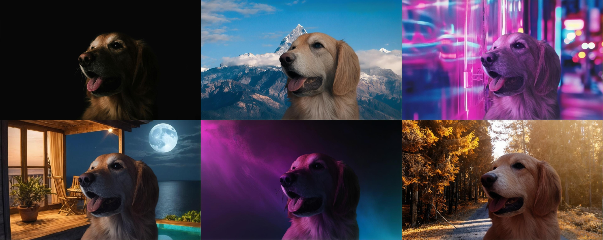
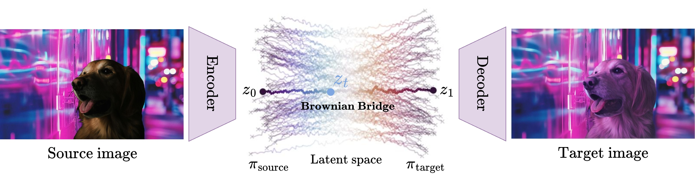
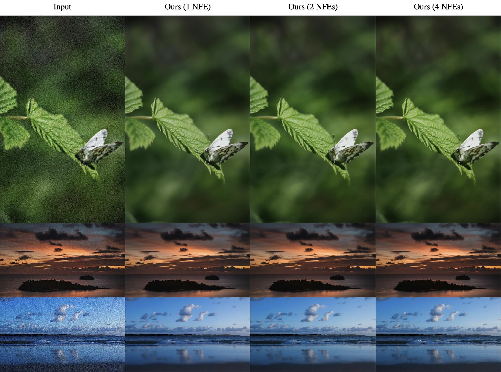
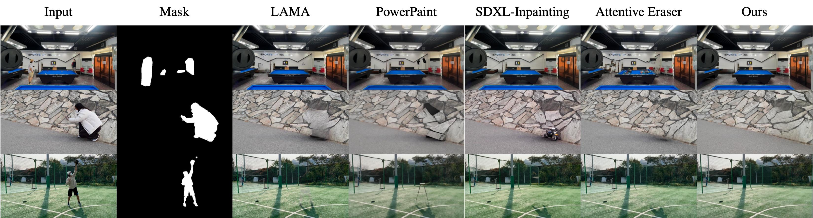
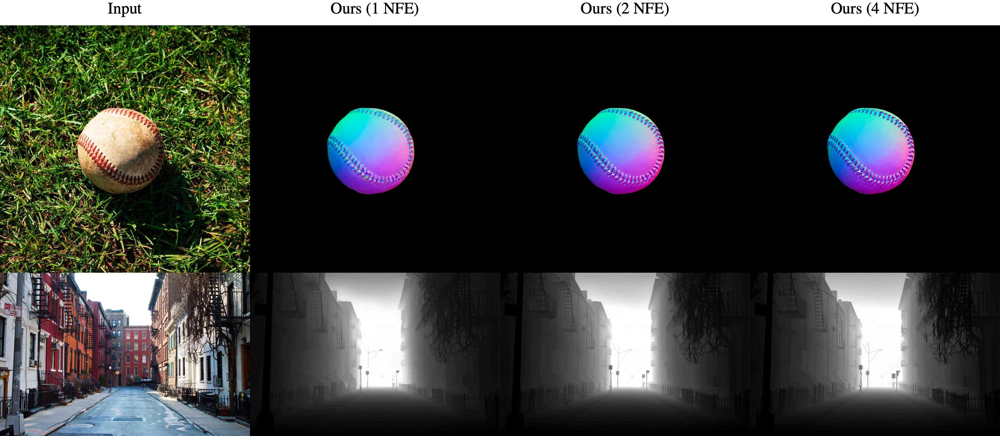

# Latent Bridge Matching (LBM)

This repository is the official implementation of the paper [LBM: Latent Bridge Matching for Fast Image-to-Image Translation](http://arxiv.org/abs/2503.07535).

<p align="center">
    <a href="https://arxiv.org/abs/2503.07535">
	    
	</a>
	<a href="https://gojasper.github.io/latent-bridge-matching/">
	    
	</a>
    <a href='https://creativecommons.org/licenses/by-nd/4.0/legalcode'>
	    
	</a>
      <a href="https://huggingface.co/spaces/jasperai/LBM_relighting">
	    
	</a>
    <br>
    </a>
      <a href="https://huggingface.co/jasperai/LBM_relighting">
	    
	</a>
    <a href="https://huggingface.co/jasperai/LBM_normals">
	    
	</a>
    <a href="https://huggingface.co/jasperai/LBM_depth">
	    
	</a>
<p align="center">
  
</p>


<!-- link to the demo with link big button -->
<p align="center">
    <a href="https://huggingface.co/spaces/jasperai/LBM_relighting">
	    <b style="font-size: 20px;">DEMO space</b>
	</a>
</p>


## Abstract
In this paper, we introduce Latent Bridge Matching (LBM), a new, versatile and scalable method that relies on Bridge Matching in a latent space to achieve fast image-to-image translation. We show that the method can reach state-of-the-art results for various image-to-image tasks using only a single inference step. In addition to its efficiency, we also demonstrate the versatility of the method across different image translation tasks such as object removal, normal and depth estimation, and object relighting. We also derive a conditional framework of LBM and demonstrate its effectiveness by tackling the tasks of controllable image relighting and shadow generation.

<p align="center">
		
</p>

## Considered Use-cases
We validate the method on various use-cases such as object relighting, image restoration, object removal, depth and normal maps estimation as well as controllable object relighting and shadow generation.
<details>
    <summary><b>Image Relighting 🔦</b></summary>
<p>
For object relighting, the method should translate the encoded source images created by pasting the foreground onto the target background image to the desired target relighted image.
</p>
<p align="center">
		
</p>
</details>
<details>
    <summary><b>Image Restoration 🧹 </b></summary>
	<p>
In the context of image restoration, the method must transport the distribution of the degraded images to the distribution of the clean images.
</p>
    <p align="center">
            
    </p>
</details>
<details>
    <summary><b>Object Removal ✂️</b></summary>
	For object removal, the model is trained to find a transport map from the masked images to the images without the objects
    <p align="center">
            
    </p>
</details>
<details>
    <summary><b>Controllable Image Relighting and Shadow Generation🕹️</b></summary>
	<p>
	We also derive a conditional framework of LBM and demonstrate its effectiveness by tackling the tasks of controllable image relighting and shadow generation
	</p>
    <p align="center">
             
    </p>
</details>
<details>
    <summary><b>Normals and Depth Maps Estimation 🗺️</b></summary>
	<p>
	Finally, we also consider common tasks such as normal and depth estimation where the model should translate an input image into a normal or depth map 
	</p>
    <p align="center">
            
    </p>
</details>


## Setup
To be up and running, you need first to create a virtual env with at least python3.10 installed and activate it

### With venv
```bash
python3.10 -m venv envs/lbm
source envs/lbm/bin/activate
```

### With conda
```bash
conda create -n lbm python=3.10
conda activate lbm
```

Then install the required dependencies and the repo in editable mode

```bash
pip install --upgrade pip
pip install -e .
```

## Inference

We provide in `examples` a simple script to perform depth and normal estimation using the proposed method. 

```bash
python examples/inference/inference.py --model_name [depth|normals|relighting] --source_image path_to_your_image.jpg --output_path output_images
```

See the trained models on the HF Hub 🤗
- [Normals Ckpt](https://huggingface.co/jasperai/LBM_normals)
- [Depth Ckpt](https://huggingface.co/jasperai/LBM_depth)
- [Relighting Ckpt](https://huggingface.co/jasperai/LBM_relighting)

## Training
We provide in `examples\training` an example of a script to train a LBM for surface normal predictions on [`hypersim`](https://github.com/apple/ml-hypersim) see [this](https://github.com/prs-eth/Marigold/blob/main/script/dataset_preprocess/hypersim/README.md) for data processing. In `examples\trainig\configs`, you will find the configuration `yaml` associated to the training script. The only thing you need to do is to amend the `SHARDS_PATH_OR_URLS` section of the `yaml` so the model is trained on your own data. Please note that this package uses [`webdataset`](https://github.com/webdataset/webdataset) to handle the datastream and so the urls you use should be fomatted according to the  [`webdataset format`](https://github.com/webdataset/webdataset?tab=readme-ov-file#the-webdataset-format). In particular, for this example, each sample in your `.tar` files needs to be composed of a `jpg` file containing the image, a `normal.png` file containing the target normals as well as a `mask.png` containing a mask indicating the valid pixels 

```
sample = {
    "jpg": source_image,
    "normal.png": normals # target_image
	"mask.png": mask # mask of valid pixels
}
```

To train the model, you can use the following command:

```bash
python examples/training/train_lbm_surface.py examples/training/config/surface.yaml
```

*Note*: Make sure to update the relevant section of the `yaml` file to use your own data and log the results on your own [WandB](https://wandb.ai/site).

## License
This code is released under the **Creative Commons BY-NC 4.0 license**.

## Citation
If you find this work useful or use it in your research, please consider citing us
```bibtex
@article{chadebec2025lbm,
      title={LBM: Latent Bridge Matching for Fast Image-to-Image Translation}, 
      author={Clément Chadebec and Onur Tasar and Sanjeev Sreetharan and Benjamin Aubin},
      year={2025},
      journal = {arXiv preprint arXiv:2503.07535},
}
```
